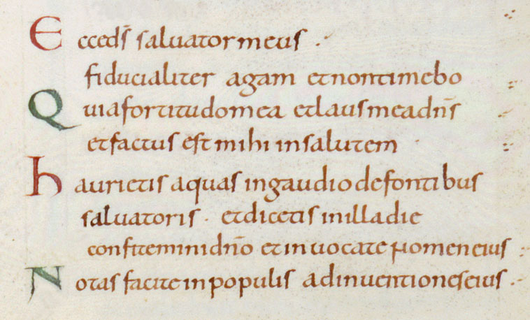
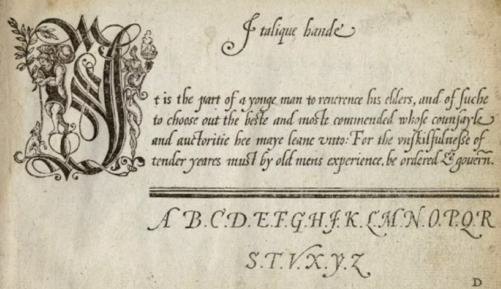

# 讲稿补充

> 说明
> 这个文档是对于[总纲](./font.md)的补充，总纲描述了关于文艺复兴的整体思路和框架，但是在图片、资料、数据、事例方面（我称之为“data”）较为缺失，所以希望在这里罗列一下需要补充的 data （并不非得由 thysrael 进行补充，有好的想法可以往里面加）。补充好的 data 也直接放在这个文件夹里即可。
> 此外，thysrael 写到第三章的时候笔力不足，希望有缘人可以补上一些 data 来增强说服力。

## 一
### 1.1
**帝国大写体**

**卡洛林小写体**

**哥特体**

**人文主义体**

**意大利斜体**

**印刷罗马体**

### 1.2

#### 1.2.1
> 体现“繁复华丽”的图片

#### 1.2.2
> 第一段涉及的字体图片

**世界上第一款印刷罗马体**

#### 1.2.3

>  第一段涉及的字体图片

**人文主义草体**

### 1.3
#### 1.3.1
> 能体现这些对比的图片（所以应该还是挺多的）

没有找到直接将三者进行对比的图片，可以把下面这三张放在一起进行对比，依次是哥特体、意大利斜体、罗马体

#### 1.3.2
> 这里面涉及了一些历史故事和技术，最好有图片或者示意图啥的，没必要非得是字体的，弄个抄写员肖像也挺好玩的，或者其他反映历史的资料。

**羊皮纸**

**艾因哈德：卡洛林时期重要的抄写员**

**僧侣抄书的场景（摄于剑桥郡St. Ives博物馆）**

**16世纪铜版画上的古腾堡肖像**

**印刷术**

#### 1.3.3

> 同上，辅助观点的历史资料

**使用哥特体的 logo**

**纽约时报 logo**

**印刷厂工人工作场景**

## 二

### 2.1
> 能把“**字体是文字的实现，文字是思想的镜像。**”画成示意图吗？感觉难点是让观众理解这个双重映射关系。

### 2.2

> 来一些例证，在 [人文主义字体的故事](https://zhuanlan.zhihu.com/p/25986731) 这里有故事介绍，最好找点别的文献资料啥的。

## 三
### 3.1
> 在设计难度方面，缺少直观演示，我个人感觉没准可以从 FontForge 手册里面截几张图。同时最好再有一些实际的数据支撑论点。

**FontForge手册截图**

**[方正正黑字体的开发流程](https://www.zhihu.com/question/20908598/answer/115437348)**

- 方正正黑字体的开发由设计、开发、测试三部分构成

- 设计师首先确定创意理念，然后根据理念设计并确定比笔形、粗细及结构，这个过程需要反复推敲修改，也是最重要的一步。制作一定数量基础字之后，设计师带领团队完成整套字库，包括GB、BIG5、GBK编码所有中文（至少GB 6763个）及对应西文字符。制作过程中，设计师仔细审查每份字样并返回修改，设计成不同粗细的6款系列字体。软件人员编写字库程序，产生TrueType字库，最终整套字库才得以完成。

- 样张审查与修改

  

> 在商业价值方面，最好有些围绕商业字体的案件纠纷或者其他类似的事件。

**方正诉宝洁“飘柔”字体侵权案**

- 2008年，方正电子起诉宝洁公司未经许可使用其倩体字“飘柔”作为文字商标，侵犯了方正电子对倩体字库和单字的著作权，要求宝洁公司停止侵权并赔偿损失134万元。

**方正诉暴雪娱乐《魔兽世界》字体侵权案**

- 2007年，北大方正起诉美国暴雪娱乐《魔兽世界》侵犯方正字库著作权，索赔金额高达4.08亿元；

**汉仪字库字体侵权案**

- 汉仪科印在小米、魅族、OPPO、vivo、金立、乐视六大手机平台上发布销售的名为“汉仪新蒂怦然心动体”、“汉仪新蒂冰淇淋之恋”和“天使之吻”三种字体，与北京子盟科技公司的“新蒂下午茶体”、“新蒂泡芙体”字形重合，涉嫌侵犯其字体版权。子盟科技已将汉仪科印诉至法院，索赔金额达150余万。

### 3.2
> 补充一些论证的例子吧，我总觉得整个“第三章”需要很多的论据，但是我实在是写不动了。

**“无论时代如何发展，思想的表达总要落实到文字上，而文字总是要借助字体来呈现。”**

- “隶书”是一种由秦始皇统一文字后形成的字体，具有强烈的政治色彩和权威性，反映了秦朝的中央集权和法家思想。隶书的特点是笔画粗细不一，结构紧凑，方正整齐，适合刻在石碑上，宣扬皇帝的功德和法令。
- “草书”是一种由汉代以来逐渐演变的字体，具有灵动自由的风格，反映了佛教的禅意和超脱。草书的特点是笔画连绵不断，结构简化省略，随心所欲，适合写在纸张上，表达个人的情感和心境。
- “楷书”是一种由隋唐时期开始普及的字体，具有平衡协调的美感，反映了文人的修养和品味。楷书的特点是笔画清晰分明，结构规范完整，中庸不偏，适合印刷在书籍上，传播文化和知识。

**“对于任何一种字体，不断地更新迭代是其发展维持活力的最重要因素。”**

- 许多传统的印刷字体如宋体、楷体等，在数字化时代经历了转变。它们被重新设计，以适应屏幕显示和打印的需求。这种数字化的演变不仅保留了传统字形的特点，同时也考虑到了数字媒体的特殊要求，如提高可读性和排版的灵活性。

**“电子字体同样也当具有演变的能力，文字的演变本身反映着思想的演变”**

- 一些字体设计公司，例如方正、汉仪， 不断推出新的字体，以响应时代的文化潮流。这可能涉及到对色彩、形状和风格的变化，以反映当下社会的审美趋势。这种变化不仅仅是技术的更新，更是对思想和文化的敏感回应。

### 3.3

> 我也不知道该补充啥。

